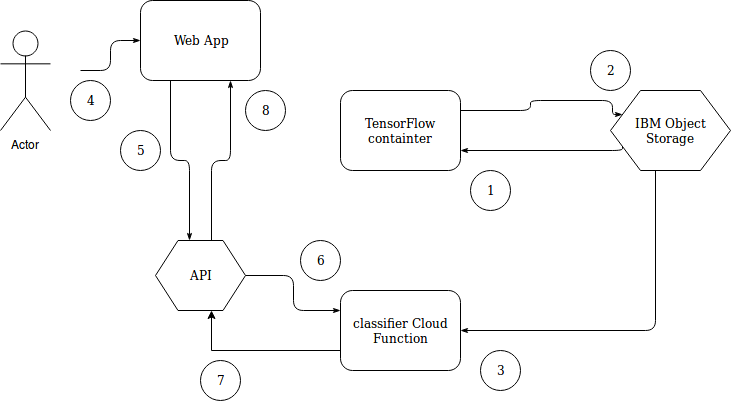

[](https://travis-ci.org/IBM/visual-recognition-tensorflow-openwhisk)

# Visual Recognition with TensorFlow and OpenWhisk

In this code pattern, we will create a visual recognition model to classify images of specific flowers using TensorFlow and OpenWhisk.  This is achieved by means of a sample application which uses an extended [MobileNet](https://research.googleblog.com/2017/06/mobilenets-open-source-models-for.html) TensorFlow model to recognize different flower types. The predictions are executed by [TensorFlow](https://www.tensorflow.org/) running in an [OpenWhisk](https://www.ibm.com/cloud/functions) function.

This project is an extension of the TensorFlow tutorial [TensorFlow for Poets](https://codelabs.developers.google.com/codelabs/tensorflow-for-poets/#0) which describes how to [retrain](https://www.tensorflow.org/tutorials/image_retraining) MobileNet's final layer of a neural network for new categories.

When the reader has completed this Code Pattern, they will understand how to:

* Crate a TensorFlow model
* Deploy Docker images
* Create Cloud Functions
* Launch a simple Cloud Foundry web app



## Flow
1. Images are read from object storage to train TensorFlow
2. Models are stored back in object storage
3. A second classifer image reads model from object storage
4. User uploads an image to the web app for classification
5. Image is converted to base64
6. API action invokes the classifier action
7. Classification result returned as JSON
8. Prediction shown to user through UI

## Included components

* [Cloud Object Storage](https://console.bluemix.net/catalog/services/object-storage): Build and deliver cost effective apps and services with high reliability and fast speed to market in an unstructured cloud data store.
* [IBM Cloud Container Service](https://console.bluemix.net/docs/containers/container_index.html): IBM Bluemix Container Service manages highly available apps inside Docker containers and Kubernetes clusters on the IBM Cloud.
* [OpenWhisk](https://console.ng.bluemix.net/openwhisk): Execute code on demand in a highly scalable, serverless environment.
* [Tensorflow](https://www.tensorflow.org/): An open source software library for numerical computation using data flow graphs.

## Featured technologies

* [Cloud](https://www.ibm.com/developerworks/learn/cloud/): Accessing computer and information technology resources through the Internet.
* [Serverless](https://www.ibm.com/cloud-computing/bluemix/openwhisk): An event-action platform that allows you to execute code in response to an event.

# Watch the Video
[](https://github.com/nheidloff/visual-recognition-tensorflow-openwhisk/raw/master/screenshots/web-app.png)

The screenshot shows the sample web application:


# Steps

1. [Clone the repo](#1-clone-the-repo)
2. [Train the model](#2-train-the-model)
3. [Setup OpenWhisk Functions](#3-setup-openwhisk-functions)
4. [Setup Web Application](#4-setup-web-application)

## Prerequisites

This project only contains the web application and an OpenWhisk function which provides the classify REST API. The project [VisualRecognitionWithTensorflow](https://github.com/AnsgarSchmidt/VisualRecognitionWithTensorflow) contains the code to train the model as well as the code for a Docker image to classify flowers. You also need an instance of IBM Object Storage to store the images and the models.

Additionally you need an IBM Cloud account and two CLIs:

* [IBM Cloud account][sign_up]
* [Cloud Foundry CLI][cloud_foundry]
* [IBM Cloud CLI](https://console.bluemix.net/docs/cli/reference/bluemix_cli/download_cli.html)

### 1. Clone the repo

Clone the two projects:

```sh
$ git clone https://github.com/IBM/visual-recognition-tensorflow-openwhisk.git
$ git clone https://github.com/AnsgarSchmidt/VisualRecognitionWithTensorflow.git
```

### 2. Train the model

```sh
$ cd VisualRecognitionWithTensorflow
$ ./Train/execscript.sh
```

### 3. Setup OpenWhisk Functions

In order to deploy the two OpenWhisk functions and one sequence run the following commands from the 'openwhisk-api' directory:

```sh
$ cd ../visual-recognition-tensorflow-openwhisk/openwhisk-api
$ bx login -a api.ng.bluemix.net
$ bx target -o <your-organization> -s <your-space>
$ bx plugin install Cloud-Functions -r Bluemix
$ wsk package update visualRecognition
$ wsk action create visualRecognition/tensorflow-classify --docker <your-dockerhub-name>/tensorflow-openwhisk-classify:latest
$ npm install
$ sh ./deploy
$ wsk action create --sequence visualRecognition/classifyAPI visualRecognition/classifyImage,visualRecognition/tensorflow-classify --web raw
```

### 4. Setup Web Application

In the [OpenWhisk web application](https://console.bluemix.net/openwhisk/manage/actions) choose your sequence and open 'Additional Details'. From there copy the URL into the clipboard. Create a new file '.env' in the 'web-app' directory. See [.env-template](.env-template) for an example. Paste the URL in this file.

From the directory 'web-app' run these commands:

```sh
$ cd web-app
$ npm install
$ npm start
```
  
Open the web application via [http://localhost:3000/](http://localhost:3000/).

Optionally: In order to deploy the application to the IBM Cloud change the application name in [manifest.yml](manifest.yml) to something unique and run these commands:

```sh
$ bx login -a api.ng.bluemix.net
$ bx target -o <your-organization> -s <your-space>
$ cf push
```

Open the web application via [http://your-application-name.mybluemix.net/](http://your-application-name.mybluemix.net/).


## License

This sample code is licensed under Apache 2.0. Full license text is available in [LICENSE](LICENSE).


## Open Source @ IBM
  Find more open source projects on the [IBM Github Page](http://ibm.github.io/).

[cloud_foundry]: https://github.com/cloudfoundry/cli
[sign_up]: https://console.ng.bluemix.net/registration/
[node_js]: http://nodejs.org/
[npm]: https://www.npmjs.com

[Ansgar Schmidt](https://ansi.23-5.eu/) and I have blogged about this project:

* [Sample Application to classify Images with TensorFlow and OpenWhisk](https://heidloff.net/article/visual-recognition-tensorflow)
* [Accessing IBM Object Store from Python](https://ansi.23-5.eu/2017/11/accessing-ibm-object-store-python/)
* [Image Recognition with Tensorflow training on Kubernetes](https://ansi.23-5.eu/2017/11/image-recognition-with-tensorflow-training-on-kubernetes/)
* [Image Recognition with Tensorflow classification on OpenWhisk](https://ansi.23-5.eu/2017/11/image-recognition-tensorflow-classification-openwhisk/)
* [Visual Recognition with TensorFlow and OpenWhisk](http://heidloff.net/article/visual-recognition-tensorflow-openwhisk)


